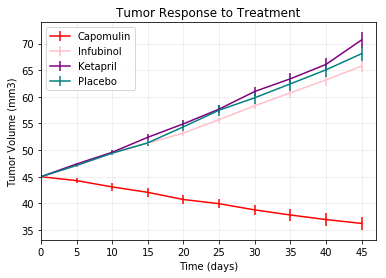
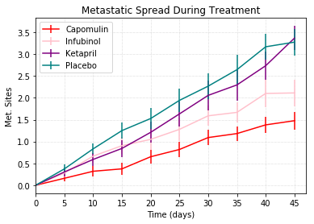
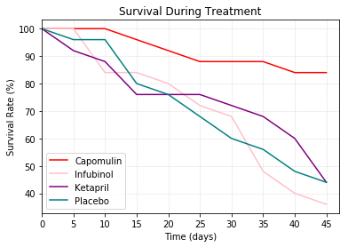
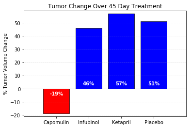

# PyMaceuticals
Analysis of large pharmaceuticals database using  Python, Juptyter, Pandas, Matplotlib, and SciPy.

Data Commentary:

1)Capomulin is the most effective drug since it decreased tumor volume over time which effectively
limited metastatic spread far better than the other two trialed medications and placebo. These factors resulted in higher survival rate amongst mice on this particular treatment.

2)Ketapril seems to actually nurture % tumor volume change which is alarming.

3)Infubinol is most frightening of these treatments since survival rate ends up being the lowest over
a period of 45 days, despite it showing positive results during the metastatic spread analysis.

```python
# Dependencies and Setup
%matplotlib inline
import matplotlib.pyplot as plt
import pandas as pd
import numpy as np
from scipy.stats import sem

# Hide warning messages in notebook
import warnings
warnings.filterwarnings('ignore')
```


```python
# File to Load (Remember to Change These)
mdd = "data/mouse_drug_data.csv"
ctd = "data/clinicaltrial_data.csv"

# Read the Mouse and Drug Data and the Clinical Trial Data
mdd_df = pd.read_csv(mdd)
ctd_df = pd.read_csv(ctd)
# mdd_df.head(20)
# ctd_df.head(20)
```


```python
# Combine the data into a single dataset
master_df = pd.merge(mdd_df, ctd_df, on="Mouse ID")

# Display the data table for preview
master_df.head()
```


<div>
<style scoped>
    .dataframe tbody tr th:only-of-type {
        vertical-align: middle;
    }

    .dataframe tbody tr th {
        vertical-align: top;
    }

    .dataframe thead th {
        text-align: right;
    }
</style>
<table border="1" class="dataframe">
  <thead>
    <tr style="text-align: right;">
      <th></th>
      <th>Mouse ID</th>
      <th>Drug</th>
      <th>Timepoint</th>
      <th>Tumor Volume (mm3)</th>
      <th>Metastatic Sites</th>
    </tr>
  </thead>
  <tbody>
    <tr>
      <th>0</th>
      <td>f234</td>
      <td>Stelasyn</td>
      <td>0</td>
      <td>45.000000</td>
      <td>0</td>
    </tr>
    <tr>
      <th>1</th>
      <td>f234</td>
      <td>Stelasyn</td>
      <td>5</td>
      <td>47.313491</td>
      <td>0</td>
    </tr>
    <tr>
      <th>2</th>
      <td>f234</td>
      <td>Stelasyn</td>
      <td>10</td>
      <td>47.904324</td>
      <td>0</td>
    </tr>
    <tr>
      <th>3</th>
      <td>f234</td>
      <td>Stelasyn</td>
      <td>15</td>
      <td>48.735197</td>
      <td>1</td>
    </tr>
    <tr>
      <th>4</th>
      <td>f234</td>
      <td>Stelasyn</td>
      <td>20</td>
      <td>51.112713</td>
      <td>2</td>
    </tr>
  </tbody>
</table>
</div>


```python
# Store the Mean Tumor Volume Data Grouped by Drug and Timepoint
# Convert to DataFrame
tumor_df = master_df.loc[:,['Drug', 'Timepoint', 'Tumor Volume (mm3)']]

# Preview DataFrame
tumor_df.head()


```


<div>
<style scoped>
    .dataframe tbody tr th:only-of-type {
        vertical-align: middle;
    }

    .dataframe tbody tr th {
        vertical-align: top;
    }

    .dataframe thead th {
        text-align: right;
    }
</style>
<table border="1" class="dataframe">
  <thead>
    <tr style="text-align: right;">
      <th></th>
      <th>Drug</th>
      <th>Timepoint</th>
      <th>Tumor Volume (mm3)</th>
    </tr>
  </thead>
  <tbody>
    <tr>
      <th>0</th>
      <td>Stelasyn</td>
      <td>0</td>
      <td>45.000000</td>
    </tr>
    <tr>
      <th>1</th>
      <td>Stelasyn</td>
      <td>5</td>
      <td>47.313491</td>
    </tr>
    <tr>
      <th>2</th>
      <td>Stelasyn</td>
      <td>10</td>
      <td>47.904324</td>
    </tr>
    <tr>
      <th>3</th>
      <td>Stelasyn</td>
      <td>15</td>
      <td>48.735197</td>
    </tr>
    <tr>
      <th>4</th>
      <td>Stelasyn</td>
      <td>20</td>
      <td>51.112713</td>
    </tr>
  </tbody>
</table>
</div>


```python
# Store the sem and mean of Tumor Volumes Grouped by Drug and Timepoint
tumor_mean_sem = tumor_df.groupby(['Drug', 'Timepoint']).agg({"Tumor Volume (mm3)" :["mean","sem"]})

# Preview DataFrame
tumor_mean_sem.head()

```


<div>
<style scoped>
    .dataframe tbody tr th:only-of-type {
        vertical-align: middle;
    }

    .dataframe tbody tr th {
        vertical-align: top;
    }

    .dataframe thead tr th {
        text-align: left;
    }

    .dataframe thead tr:last-of-type th {
        text-align: right;
    }
</style>
<table border="1" class="dataframe">
  <thead>
    <tr>
      <th></th>
      <th></th>
      <th colspan="2" halign="left">Tumor Volume (mm3)</th>
    </tr>
    <tr>
      <th></th>
      <th></th>
      <th>mean</th>
      <th>sem</th>
    </tr>
    <tr>
      <th>Drug</th>
      <th>Timepoint</th>
      <th></th>
      <th></th>
    </tr>
  </thead>
  <tbody>
    <tr>
      <th rowspan="5" valign="top">Capomulin</th>
      <th>0</th>
      <td>45.000000</td>
      <td>0.000000</td>
    </tr>
    <tr>
      <th>5</th>
      <td>44.266086</td>
      <td>0.448593</td>
    </tr>
    <tr>
      <th>10</th>
      <td>43.084291</td>
      <td>0.702684</td>
    </tr>
    <tr>
      <th>15</th>
      <td>42.064317</td>
      <td>0.838617</td>
    </tr>
    <tr>
      <th>20</th>
      <td>40.716325</td>
      <td>0.909731</td>
    </tr>
  </tbody>
</table>
</div>


```python
#reformat df
tumor_plot = tumor_mean_sem.unstack(-1)
tumor_plot

```


<div>
<style scoped>
    .dataframe tbody tr th:only-of-type {
        vertical-align: middle;
    }

    .dataframe tbody tr th {
        vertical-align: top;
    }

    .dataframe thead tr th {
        text-align: left;
    }

    .dataframe thead tr:last-of-type th {
        text-align: right;
    }
</style>
<table border="1" class="dataframe">
  <thead>
    <tr>
      <th></th>
      <th colspan="20" halign="left">Tumor Volume (mm3)</th>
    </tr>
    <tr>
      <th></th>
      <th colspan="10" halign="left">mean</th>
      <th colspan="10" halign="left">sem</th>
    </tr>
    <tr>
      <th>Timepoint</th>
      <th>0</th>
      <th>5</th>
      <th>10</th>
      <th>15</th>
      <th>20</th>
      <th>25</th>
      <th>30</th>
      <th>35</th>
      <th>40</th>
      <th>45</th>
      <th>0</th>
      <th>5</th>
      <th>10</th>
      <th>15</th>
      <th>20</th>
      <th>25</th>
      <th>30</th>
      <th>35</th>
      <th>40</th>
      <th>45</th>
    </tr>
    <tr>
      <th>Drug</th>
      <th></th>
      <th></th>
      <th></th>
      <th></th>
      <th></th>
      <th></th>
      <th></th>
      <th></th>
      <th></th>
      <th></th>
      <th></th>
      <th></th>
      <th></th>
      <th></th>
      <th></th>
      <th></th>
      <th></th>
      <th></th>
      <th></th>
      <th></th>
    </tr>
  </thead>
  <tbody>
    <tr>
      <th>Capomulin</th>
      <td>45.0</td>
      <td>44.266086</td>
      <td>43.084291</td>
      <td>42.064317</td>
      <td>40.716325</td>
      <td>39.939528</td>
      <td>38.769339</td>
      <td>37.816839</td>
      <td>36.958001</td>
      <td>36.236114</td>
      <td>0.0</td>
      <td>0.448593</td>
      <td>0.702684</td>
      <td>0.838617</td>
      <td>0.909731</td>
      <td>0.881642</td>
      <td>0.934460</td>
      <td>1.052241</td>
      <td>1.223608</td>
      <td>1.223977</td>
    </tr>
    <tr>
      <th>Ceftamin</th>
      <td>45.0</td>
      <td>46.503051</td>
      <td>48.285125</td>
      <td>50.094055</td>
      <td>52.157049</td>
      <td>54.287674</td>
      <td>56.769517</td>
      <td>58.827548</td>
      <td>61.467895</td>
      <td>64.132421</td>
      <td>0.0</td>
      <td>0.164505</td>
      <td>0.236144</td>
      <td>0.332053</td>
      <td>0.359482</td>
      <td>0.439356</td>
      <td>0.490620</td>
      <td>0.692248</td>
      <td>0.708505</td>
      <td>0.902358</td>
    </tr>
    <tr>
      <th>Infubinol</th>
      <td>45.0</td>
      <td>47.062001</td>
      <td>49.403909</td>
      <td>51.296397</td>
      <td>53.197691</td>
      <td>55.715252</td>
      <td>58.299397</td>
      <td>60.742461</td>
      <td>63.162824</td>
      <td>65.755562</td>
      <td>0.0</td>
      <td>0.235102</td>
      <td>0.282346</td>
      <td>0.357705</td>
      <td>0.476210</td>
      <td>0.550315</td>
      <td>0.631061</td>
      <td>0.984155</td>
      <td>1.055220</td>
      <td>1.144427</td>
    </tr>
    <tr>
      <th>Ketapril</th>
      <td>45.0</td>
      <td>47.389175</td>
      <td>49.582269</td>
      <td>52.399974</td>
      <td>54.920935</td>
      <td>57.678982</td>
      <td>60.994507</td>
      <td>63.371686</td>
      <td>66.068580</td>
      <td>70.662958</td>
      <td>0.0</td>
      <td>0.264819</td>
      <td>0.357421</td>
      <td>0.580268</td>
      <td>0.726484</td>
      <td>0.755413</td>
      <td>0.934121</td>
      <td>1.127867</td>
      <td>1.158449</td>
      <td>1.453186</td>
    </tr>
    <tr>
      <th>Naftisol</th>
      <td>45.0</td>
      <td>46.796098</td>
      <td>48.694210</td>
      <td>50.933018</td>
      <td>53.644087</td>
      <td>56.731968</td>
      <td>59.559509</td>
      <td>62.685087</td>
      <td>65.600754</td>
      <td>69.265506</td>
      <td>0.0</td>
      <td>0.202385</td>
      <td>0.319415</td>
      <td>0.444378</td>
      <td>0.595260</td>
      <td>0.813706</td>
      <td>0.975496</td>
      <td>1.013769</td>
      <td>1.118567</td>
      <td>1.416363</td>
    </tr>
    <tr>
      <th>Placebo</th>
      <td>45.0</td>
      <td>47.125589</td>
      <td>49.423329</td>
      <td>51.359742</td>
      <td>54.364417</td>
      <td>57.482574</td>
      <td>59.809063</td>
      <td>62.420615</td>
      <td>65.052675</td>
      <td>68.084082</td>
      <td>0.0</td>
      <td>0.218091</td>
      <td>0.402064</td>
      <td>0.614461</td>
      <td>0.839609</td>
      <td>1.034872</td>
      <td>1.218231</td>
      <td>1.287481</td>
      <td>1.370634</td>
      <td>1.351726</td>
    </tr>
    <tr>
      <th>Propriva</th>
      <td>45.0</td>
      <td>47.248967</td>
      <td>49.101541</td>
      <td>51.067318</td>
      <td>53.346737</td>
      <td>55.504138</td>
      <td>58.196374</td>
      <td>60.350199</td>
      <td>63.045537</td>
      <td>66.258529</td>
      <td>0.0</td>
      <td>0.231708</td>
      <td>0.376195</td>
      <td>0.466109</td>
      <td>0.555181</td>
      <td>0.577401</td>
      <td>0.746045</td>
      <td>1.084929</td>
      <td>1.564779</td>
      <td>1.888586</td>
    </tr>
    <tr>
      <th>Ramicane</th>
      <td>45.0</td>
      <td>43.944859</td>
      <td>42.531957</td>
      <td>41.495061</td>
      <td>40.238325</td>
      <td>38.974300</td>
      <td>38.703137</td>
      <td>37.451996</td>
      <td>36.574081</td>
      <td>34.955595</td>
      <td>0.0</td>
      <td>0.482955</td>
      <td>0.720225</td>
      <td>0.770432</td>
      <td>0.786199</td>
      <td>0.746991</td>
      <td>0.864906</td>
      <td>0.967433</td>
      <td>1.128445</td>
      <td>1.226805</td>
    </tr>
    <tr>
      <th>Stelasyn</th>
      <td>45.0</td>
      <td>47.527452</td>
      <td>49.463844</td>
      <td>51.529409</td>
      <td>54.067395</td>
      <td>56.166123</td>
      <td>59.826738</td>
      <td>62.440699</td>
      <td>65.356386</td>
      <td>68.438310</td>
      <td>0.0</td>
      <td>0.239862</td>
      <td>0.433678</td>
      <td>0.493261</td>
      <td>0.621889</td>
      <td>0.741922</td>
      <td>0.899548</td>
      <td>1.003186</td>
      <td>1.410435</td>
      <td>1.576556</td>
    </tr>
    <tr>
      <th>Zoniferol</th>
      <td>45.0</td>
      <td>46.851818</td>
      <td>48.689881</td>
      <td>50.779059</td>
      <td>53.170334</td>
      <td>55.432935</td>
      <td>57.713531</td>
      <td>60.089372</td>
      <td>62.916692</td>
      <td>65.960888</td>
      <td>0.0</td>
      <td>0.188950</td>
      <td>0.263949</td>
      <td>0.370544</td>
      <td>0.533182</td>
      <td>0.602513</td>
      <td>0.800043</td>
      <td>0.881426</td>
      <td>0.998515</td>
      <td>1.003576</td>
    </tr>
  </tbody>
</table>
</div>


```python
# Create lists of the tumor volume means for each of the four drugs being compared
cap_tvmean_list = tumor_mean_sem.loc['Capomulin'].loc[:, 'Tumor Volume (mm3)'].loc[:,'mean'].tolist()
inf_tvmean_list = tumor_mean_sem.loc['Infubinol'].loc[:, 'Tumor Volume (mm3)'].loc[:,'mean'].tolist()
ket_tvmean_list = tumor_mean_sem.loc['Ketapril'].loc[:, 'Tumor Volume (mm3)'].loc[:,'mean'].tolist()
plc_tvmean_list = tumor_mean_sem.loc['Placebo'].loc[:, 'Tumor Volume (mm3)'].loc[:,'mean'].tolist()
```


```python
# Create lists of the tumor volume sems for each of the four drugs being compared
cap_tvsem_list = tumor_mean_sem.loc['Capomulin'].loc[:, 'Tumor Volume (mm3)'].loc[:,'sem'].tolist()
inf_tvsem_list = tumor_mean_sem.loc['Infubinol'].loc[:, 'Tumor Volume (mm3)'].loc[:,'sem'].tolist()
ket_tvsem_list = tumor_mean_sem.loc['Ketapril'].loc[:, 'Tumor Volume (mm3)'].loc[:,'sem'].tolist()
plc_tvsem_list = tumor_mean_sem.loc['Placebo'].loc[:, 'Tumor Volume (mm3)'].loc[:,'sem'].tolist()
```


```python
# Scatter plot showing how tumor volume changes over time for each treatment
ax = plt.subplot(111)

# Set the x axis from 0 to 45 in increments of 5
x_axis = np.arange(0, 50, 5)


# Set the plot title and axes titles
plt.title("Tumor Response to Treatment")
plt.xlabel("Time (days)")
plt.ylabel("Tumor Volume (mm3)")

ax.errorbar(x_axis, cap_tvmean_list, yerr=cap_tvsem_list, fmt="red",
                   label="Capomulin")
ax.errorbar(x_axis, inf_tvmean_list, yerr=inf_tvsem_list, fmt="blue",
                   label="Infubinol")
ax.errorbar(x_axis, ket_tvmean_list, yerr=ket_tvsem_list, fmt="green",
                   label="Ketapril")
ax.errorbar(x_axis, plc_tvmean_list, yerr=plc_tvsem_list, fmt="black",
                   label="Placebo")

# Add the legend, tick specificity, gridlines, and limits.
ax.legend(loc=2)
tick_locations = [value for value in x_axis]
ax.set_xticks(tick_locations)
ax.grid('on', which='major', axis='both', linestyle='dotted', linewidth=0.5)
plt.xlim(0, max(x_axis)+2)
```


    (0, 47)





```python
# For tumor_vol_df extract only columns "Drug", "Timepoint" and "Metastic Sites"
meta_sites_df = master_df.loc[:,['Drug', 'Timepoint', 'Metastatic Sites']]
meta_sites_df.head()
```


<div>
<style scoped>
    .dataframe tbody tr th:only-of-type {
        vertical-align: middle;
    }

    .dataframe tbody tr th {
        vertical-align: top;
    }

    .dataframe thead th {
        text-align: right;
    }
</style>
<table border="1" class="dataframe">
  <thead>
    <tr style="text-align: right;">
      <th></th>
      <th>Drug</th>
      <th>Timepoint</th>
      <th>Metastatic Sites</th>
    </tr>
  </thead>
  <tbody>
    <tr>
      <th>0</th>
      <td>Stelasyn</td>
      <td>0</td>
      <td>0</td>
    </tr>
    <tr>
      <th>1</th>
      <td>Stelasyn</td>
      <td>5</td>
      <td>0</td>
    </tr>
    <tr>
      <th>2</th>
      <td>Stelasyn</td>
      <td>10</td>
      <td>0</td>
    </tr>
    <tr>
      <th>3</th>
      <td>Stelasyn</td>
      <td>15</td>
      <td>1</td>
    </tr>
    <tr>
      <th>4</th>
      <td>Stelasyn</td>
      <td>20</td>
      <td>2</td>
    </tr>
  </tbody>
</table>
</div>


```python
# Group meta_sites_df by 'Drug' and 'Timepoint'
# Calculate mean and standard error of the mean (sem) for the 'Metastatic Sites'
mean_sem_meta = meta_sites_df.groupby(['Drug', 'Timepoint']).agg({"Metastatic Sites" :["mean", "sem"]})
mean_sem_meta.head()
```


<div>
<style scoped>
    .dataframe tbody tr th:only-of-type {
        vertical-align: middle;
    }

    .dataframe tbody tr th {
        vertical-align: top;
    }

    .dataframe thead tr th {
        text-align: left;
    }

    .dataframe thead tr:last-of-type th {
        text-align: right;
    }
</style>
<table border="1" class="dataframe">
  <thead>
    <tr>
      <th></th>
      <th></th>
      <th colspan="2" halign="left">Metastatic Sites</th>
    </tr>
    <tr>
      <th></th>
      <th></th>
      <th>mean</th>
      <th>sem</th>
    </tr>
    <tr>
      <th>Drug</th>
      <th>Timepoint</th>
      <th></th>
      <th></th>
    </tr>
  </thead>
  <tbody>
    <tr>
      <th rowspan="5" valign="top">Capomulin</th>
      <th>0</th>
      <td>0.000000</td>
      <td>0.000000</td>
    </tr>
    <tr>
      <th>5</th>
      <td>0.160000</td>
      <td>0.074833</td>
    </tr>
    <tr>
      <th>10</th>
      <td>0.320000</td>
      <td>0.125433</td>
    </tr>
    <tr>
      <th>15</th>
      <td>0.375000</td>
      <td>0.132048</td>
    </tr>
    <tr>
      <th>20</th>
      <td>0.652174</td>
      <td>0.161621</td>
    </tr>
  </tbody>
</table>
</div>


```python
# Create lists of the metastatic sites means for each of the four drugs being compared
cap_mtmean_list = mean_sem_meta.loc['Capomulin'].loc[:, 'Metastatic Sites'].loc[:,'mean'].tolist()
inf_mtmean_list = mean_sem_meta.loc['Infubinol'].loc[:, 'Metastatic Sites'].loc[:,'mean'].tolist()
ket_mtmean_list = mean_sem_meta.loc['Ketapril'].loc[:, 'Metastatic Sites'].loc[:,'mean'].tolist()
plc_mtmean_list = mean_sem_meta.loc['Placebo'].loc[:, 'Metastatic Sites'].loc[:,'mean'].tolist()
```


```python
# Create lists of the metastatic sites sems for each of the four drugs being compared
cap_mtsem_list = mean_sem_meta.loc['Capomulin'].loc[:, 'Metastatic Sites'].loc[:,'sem'].tolist()
inf_mtsem_list = mean_sem_meta.loc['Infubinol'].loc[:, 'Metastatic Sites'].loc[:,'sem'].tolist()
ket_mtsem_list = mean_sem_meta.loc['Ketapril'].loc[:, 'Metastatic Sites'].loc[:,'sem'].tolist()
plc_mtsem_list = mean_sem_meta.loc['Placebo'].loc[:, 'Metastatic Sites'].loc[:,'sem'].tolist()
```


```python
# Scatter plot showing metastatic spread over time for each treatment
ax = plt.subplot(111)

# Set the x axis from 0 to 45 in increments of 5
x_axis = np.arange(0, 50, 5)

# Set the plot title and axes titles
plt.title("Metastatic Spread During Treatment")
plt.xlabel("Time (days)")
plt.ylabel("Met. Sites")

# Plot the 'mean' list vs. the established x axis with error
ax.errorbar(x_axis, cap_mtmean_list, yerr=cap_mtsem_list, fmt="red",
                   label="Capomulin")
ax.errorbar(x_axis, inf_mtmean_list, yerr=inf_mtsem_list, fmt="blue",
                   label="Infubinol")
ax.errorbar(x_axis, ket_mtmean_list, yerr=ket_mtsem_list, fmt="green",
                   label="Ketapril")
ax.errorbar(x_axis, plc_mtmean_list, yerr=plc_mtsem_list, fmt="black",
                   label="Placebo")

# Add the legend, tick specificity, gridlines, and limits.
ax.legend(loc=2)
tick_locations = [value for value in x_axis]
ax.set_xticks(tick_locations)
ax.grid('on', which='major', axis='both', linestyle='dotted', linewidth=0.5)
plt.xlim(0, max(x_axis)+2)
```


    (0, 47)





```python
# Get the mouse survival rate over time grouped by 'Drug' and 'Mouse ID'
mouse_count = master_df.groupby(['Drug', 'Timepoint'])['Mouse ID'].count()
mouse_count.head()
```


    Drug       Timepoint
    Capomulin  0            25
               5            25
               10           25
               15           24
               20           23
    Name: Mouse ID, dtype: int64


```python
 # Create lists of the mouse counts for each of the four drugs at the different timepoints
cap_surv_list = mouse_count.loc['Capomulin'].tolist()
inf_surv_list = mouse_count.loc['Infubinol'].tolist()
ket_surv_list = mouse_count.loc['Ketapril'].tolist()
plc_surv_list = mouse_count.loc['Placebo'].tolist()
```


```python
# List comprehension to get the mouse survival rate
# Each value in the lists is divided by the first value of the respective list to get a percentage
cap_surv_rate = [(x/cap_surv_list[0])*100 for x in cap_surv_list]
inf_surv_rate = [(x/inf_surv_list[0])*100 for x in inf_surv_list]
ket_surv_rate = [(x/ket_surv_list[0])*100 for x in ket_surv_list]
plc_surv_rate = [(x/plc_surv_list[0])*100 for x in plc_surv_list]
```


```python

# Scatter plot showing mouse survival rate over time for each treatment# Scatte

ax = plt.subplot(111)

# Set the x axis from 0 to 45 in increments of 5
x_axis = np.arange(0, 50, 5)

# Set the plot title and axes titles
plt.title("Survival During Treatment")
plt.xlabel("Time (days)")
plt.ylabel("Survival Rate (%)")

# Plot the 'mean' list vs. the established x axis with error
ax.plot(x_axis, cap_surv_rate, color="red", label="Capomulin")
ax.plot(x_axis, inf_surv_rate, color="blue", label="Infubinol")
ax.plot(x_axis, ket_surv_rate, color="green", label="Ketapril")
ax.plot(x_axis, plc_surv_rate, color="black", label="Placebo")

# Add the legend, tick specificity, gridlines, and limits.
ax.legend(loc=3)
tick_locations = [value for value in x_axis]
ax.set_xticks(tick_locations)
ax.grid('on', which='major', axis='both', linestyle='dotted', linewidth=0.5)
plt.xlim(0, max(x_axis)+2)
```


    (0, 47)





```python
# compares the total % tumor volume change for each drug across the full 45 days.
cap_tv_change = int(((cap_tvmean_list[-1] - cap_tvmean_list[0])/cap_tvmean_list[0])*100)
inf_tv_change = int(((inf_tvmean_list[-1] - inf_tvmean_list[0])/inf_tvmean_list[0])*100)
ket_tv_change = int(((ket_tvmean_list[-1] - ket_tvmean_list[0])/ket_tvmean_list[0])*100)
plc_tv_change = int(((plc_tvmean_list[-1] - plc_tvmean_list[0])/plc_tvmean_list[0])*100)
```


```python
# Bar graph showing tumor growth % over time for each treatment

# y values using a list
y = [cap_tv_change, inf_tv_change, ket_tv_change, plc_tv_change]
# Set the x axis from 0 to 45 in increments of 5
x_axis = np.arange(len(y))

# Set the colors of the bars depending on if pos or neg
# Neg % are green
# Pos % are red
colors = []
for item in y:
    if item < 0:
        colors.append('green')
    else:
        colors.append('red')

# Set up the bar graph
tumor_growth_bar = plt.bar(x_axis, y, color=colors, alpha=1.0, edgecolor='gold', linewidth=0.7)

# Set the plot title and axes titles
plt.title("Tumor Change Over 45 Day Treatment")
plt.ylabel("% Tumor Volume Change")

# plt.xticks() set the location and labels of the ticks on the x axis
tick_locations = [value for value in x_axis]
plt.xticks(tick_locations, ["Capomulin", "Infubinol", "Ketapril", "Placebo"])

# Set the limit of the x and y axes. lim(start, end)
plt.xlim(-1, len(x_axis))
plt.ylim(min(y)-2, max(y)+2)

# Plot horizontal line at y=0
plt.hlines(0, -2, len(x_axis), alpha=1.0, linewidth=0.5)

# Add gridlines
plt.grid('on', which='major', axis='y', linestyle='dotted', linewidth=0.5)

# Set up labels with the percentage change for each bar
def autolabel(rects):
    autolabel
    for i,rect in enumerate(rects):
        height = int(y[i])
        if height >= 0:
            plt.text(rect.get_x()+rect.get_width()/2., 2, '%s%%'% (y[i]),
                ha='center', va='bottom', color='white', weight='bold')
        else:
            plt.text(rect.get_x()+rect.get_width()/2., -2, '%s%%'% (y[i]),
                ha='center', va='top', color='white', weight='bold')          

autolabel(tumor_growth_bar)
```



